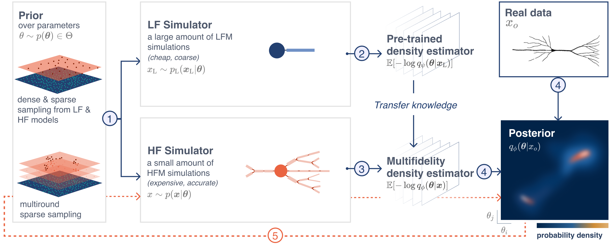
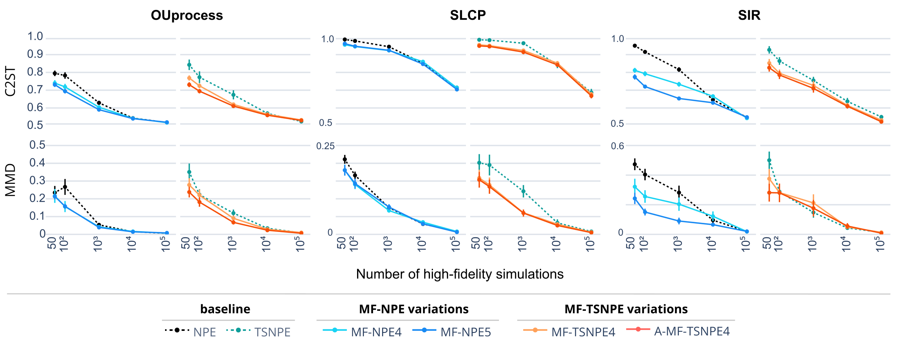

# Multifidelity Simulation-based Inference for Computationally Expensive Simulators
Anastasia N. Krouglova, Hayden R Johnson, Basile Confavreux, Michael Deistler, Pedro J. Goncalves, ICLR 2026. 

[Read the official paper](https://openreview.net/pdf?id=bj0dcKp9t6)

---

Across many domains of science, stochastic models are an essential tool to understand the mechanisms underlying empirically observed data. Models can be of different levels of detail and accuracy, with models of high-fidelity (i.e., high accuracy) to the phenomena under study being often preferable. However, inferring parameters of high-fidelity models via simulation-based inference is challenging, especially when the simulator is computationally expensive. We introduce MF-(TS)NPE, a multifidelity approach to neural posterior estimation that uses transfer learning to leverage inexpensive low-fidelity simulations to efficiently infer parameters of high-fidelity simulators. MF-(TS)NPE applies the multifidelity scheme to both amortized and non-amortized neural posterior estimation. We further improve simulation efficiency by introducing A-MF-TSNPE, a sequential variant that uses an acquisition function targeting the predictive uncertainty of the density estimator to adaptively select high-fidelity parameters. On established benchmark and neuroscience tasks, our approaches require up to two orders of magnitude fewer high-fidelity simulations than current methods, while showing comparable performance. Overall, our approaches open new opportunities to perform efficient Bayesian inference on computationally expensive simulators.




# Package information
This repository provides the full pipeline for training and evaluating multifidelity simulation-based inference models (e.g., MF-NPE, MF-TSNPE, Active MF-TSNPE, etc.) across four benchmarking tasks and two real-world tasks. Each task includes a high-fidelity simulator and a corresponding low-fidelity approximation. The supported tasks are:
- OUprocess
- SIR
- SLCP
- GaussianBlob
- L5PC [1]
- SynapticPlasticity [2]


### **[1] Neuroscience Task: L5PC Multicompartmental Neuron Model (L5PC)**
A biophysically detailed neuron model based on the Layer 5 Pyramidal Cell (L5PC). The membrane potential dynamics in each compartment are governed by **Hodgkin–Huxley-type equations**, simulating realistic voltage responses to injected currents. This task emphasizes morphologically rich, high-dimensional dynamics.

### **[2] Neuroscience Task: Synaptic Plasticity in a Recurrent Spiking Network (SynapticPlasticity)**
A recurrent spiking network of 4096 excitatory and 1024 inhibitory leaky integrate-and-fire neurons, connected via conductance-based synapses.
The **high-fidelity simulator** is a full network simulation implemented in **Auryn** (Zenke & Gerstner, 2014), the **low-fidelity simulator** is respectively a mean-field approximation of the full network dynamics.


# Requirements
To run training and evaluation individually via CLI commands (see training and evaluation), set up the environment as following:

1. Create and activate a new conda environment: 
```bash
conda create --name mf_npe python=3.10
conda activate mf_npe
```
2. Install the package (and all dependencies): 
```bash
pip install -e .
```

In case you don't have conda, follow the following procedure (after downloading and installing python3.10 from one of the available repos):

```
git clone https://github.com/goncalab/multifidelity-NPE
cd multifidelity-NPE
. python3.10 -m venv .
source .venv/bin/activate
pip install -e . 
```


## Dataset
To ensure reproducibility of our results, we provide the exact dataset used in the paper.
The data to reproduce the OUprocess for two dimensions results are provided together with the code, and can immediately be tested within the current repository. 

We also provide all other data used to reproduce the results from the L5PC neuron, Synaptic Plasticity task and additional benchmarks, wich should be downloaded with the following link:
[Download from OSF](https://osf.io/afxeg/?view_only=3be385a619cb4bff955ce06d1df95d03).
After downloading, place the datasets into the `data/` directory at the top level of the project.
Your project directory should then be organized as follows:

```php
project_root/
├── mf_npe/ # Core code and modules for the multifidelity NPE implementation
├── data/ # Downloaded datasets
  ├── OUprocess # Already provided for a 2 dimensional theta
  ├── SLCP # Should be downloaded
  ├── SIR # Should be downloaded
  ├── GaussianBlob # Should be downloaded
  ├── L5PC # Should be downloaded 
  ├── SynapticPlasticity # Should be downloaded 
├── plot_figures/ # Scripts and outputs for generating figures
├── train.py # Script for training the model
└── eval.py # Script for evaluating model performance
```
Make sure to follow this structure to avoid path-related issues when running the code.


# Training
To train the models in the paper with your own configuration, run the following command:

```bash
python train.py \
 --models_to_run npe mf_npe \
 --simulator_task OUprocess \
 --lf_datasize 1000 \
 --hf_datasize 50 \
 --n_true_xen 10 \
 --seed 12 \
 --n_net_inits 1
```

You can modify the following arguments based on your experimental needs (for more options, see `train.py`):

The supported options for the following arguments are:
- **models_to_run**: `npe`, `mf_npe`,  `mf_abc`, `tsnpe`, `mf_tsnpe`, `a_mf_tsnpe`
- **simulator_task**: `OUprocess`, `SLCP`, `SIR`, `GaussianBlob`, `L5PC`, `SynapticPlasticity`
- **lf_datasize**: `1000`, `10_000`, `100_000`
- **hf_datasize**: `50`, `100`, `1000`, `10_000`, `100_000`

> **Generate data** To generate new training data and/or true data, add the following flags to the `python train.py` command: `--generate_true_data` and `--generate_train_data`.

> **⚠️ Warning:** By default, the number of true observations ($x_o$) is set to the values used in the paper. However, for sequential methods such as `a_mf_tsnpe` and `mf_tsnpe`, the low fidelity neural density estimators $q_\phi$ are refined through an active learning scheme that targets a **fixed** observation $x_o$. As a result, the pipeline must be run separately for each true observation to ensure a fair method comparison, which can lead to long training times.

To run a quick test for sequential methods, consider explicitly limiting the number of true observations by setting the `--n_true_xen` flag:
```bash
--n_true_xen 2
```

# Evaluation
To evaluate models on a selected task (e.g. OUprocess), that has been pretrained using `train.py`, run:

```bash
python eval.py \
 --models_to_run npe mf_npe \
 --simulator_task OUprocess \
 --lf_datasize 1000 \
 --hf_datasize 50 \
 --eval_metric c2st \
 --n_true_xen 10 \
 --seed 12 \
 --n_net_inits 1
```

The supported options for the following arguments are:
- **models_to_evaluate**: `npe`, `mf_npe`, `mf_tsnpe`, `mf_abc`, `a_mf_tsnpe`
- **simulator_task**: `OUprocess`, `SLCP`, `SIR`, `GaussianBlob`, `L5PC`, `SynapticPlasticity`
- **lf_datasize**: `1000`, `10_000`, `100_000`
- **hf_datasize**: `50`, `100`, `1000`, `10_000`, `100_000`
- **eval_metric**: `c2st`, `mmd`, `wasserstein`, `nltp`, `nrmse`


> **Note:** To enable visualization in headless runs, set `show_plots=True` in `config/plot.py`. All visualizations are by default saved in `./data`. 

> **Note:** `mf_abc` was trained on 165, 330, 3330, 33330, 333330 LF samples, since approximately 30% samples are used as high-fidelity samples.

> **Note:** If you want to generate new data samples, add the following flags `--generate_true_data` or `--generate_train_data` respectively for true observation and train data.

> **Note:** Use `c2st`, `mmd`, `wasserstein` only for benchmarking tasks with a ground truth posterior. Overall, the wasserstein distance is observed to be computationally much slower than `c2st` and `mmd`.


# Pre-trained models
The computational bottleneck in our pipeline lies in generating simulations, not in training the density estimators. To save time and resources, we provide a zip file containing simulation data, pre-trained density estimators and posterior samples for all three benchmark tasks.

You can download the data from OSF using the following link: [Download from OSF](https://osf.io/afxeg/?view_only=3be385a619cb4bff955ce06d1df95d03).


# Results
Run the following command to reproduce the main figures from the paper, where the performance is compared with respect to the number of high-fidelity simulations used for training (make sure to have the SIR and SLCP model downloaded from OSF).

```bash
cd plot_figures
python Figure_MethodComparison.py --tasks OUprocess SIR SLCP --theta_dim 2 2 5 --plot_amortized_and_non_amortized_seperately --eval_metric c2st mmd
```

The supported options for the following arguments are:
- **task**: `OUprocess`, `SIR`, `L5PC`, `GaussianBlob`, `L5PC`, `SynapticPlasticity`
- **eval_metric**: `c2st`, `mmd`, `wasserstein`, `nltp`, `nrmse`

This script generates the figure in both .svg (vector format) and .html (interactive format, which is useful for inspecting exact values by hovering in a web browser). 

The script will also print the location where the figure is saved, which regenerates the following results:



# Adding new experiments
- add the simulator as a class in `simulator/task N`
- add `get_task_name` and settings to `simulator/setup_for_tasks.py`
- add `get_task_name` to `utils/task_setup.py > load_task_setup()`
- add `simulator` and `theta_dim `to `eval.py` 
- add default dimensions and default number of xen to `train.py`
